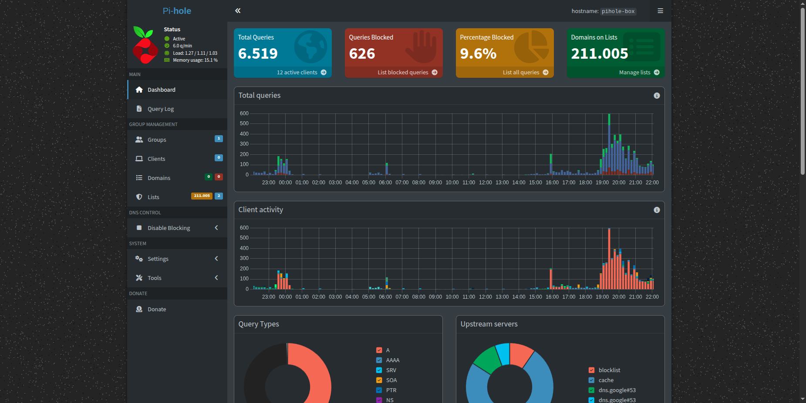
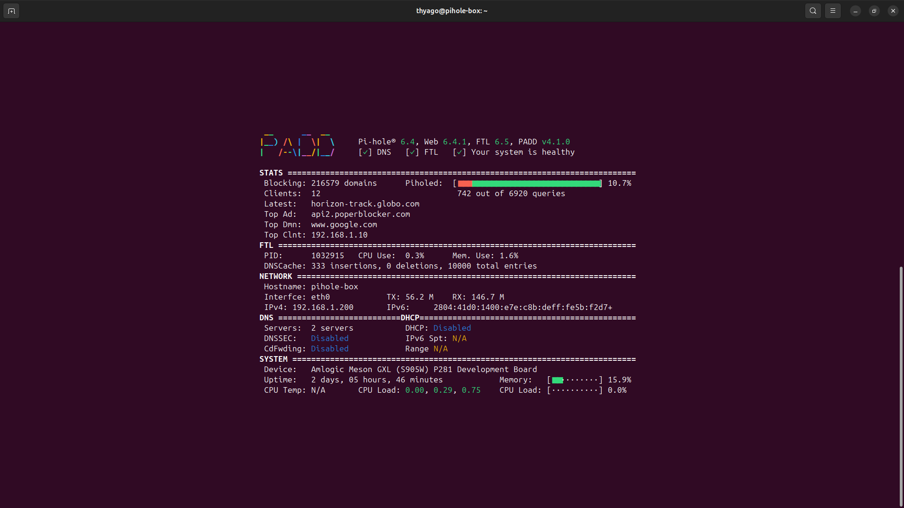
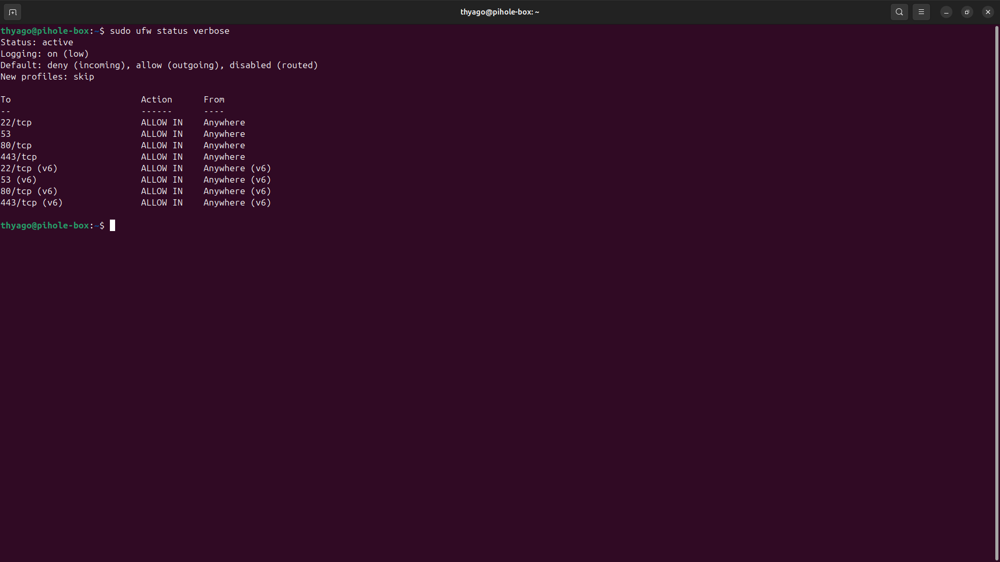

# Projeto Pi-hole: Mais privacidade na minha rede

Criei este projeto para bloquear anúncios e rastreadores em todos os aparelhos da minha casa direto pela rede, sem precisar instalar nada em cada celular ou PC. O diferencial deste projeto foi aproveitar uma TV Box antiga (Aquário STV-2000). Em vez de virar lixo eletrônico, ela agora é um servidor de segurança.

## O que eu usei:
* **Hardware:** Uma TV Box com Linux (Armbian/Debian).
* **Software:** Pi-hole v6 (para o bloqueio) e UFW (para segurança).

## Resultado (Vídeos)
* 
* 

## O que aprendi fazendo isso:
1. **Linux:** Como configurar pastas, permissões e instalar serviços via terminal.
2. **Redes:** Como funciona o DNS e como configurar o IP fixo.
3. **Segurança:** Como fechar as portas do servidor com um Firewall.

## Fotos do Sistema
*Dashboard do Pi-hole e monitoramento via terminal:*

